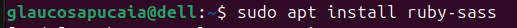
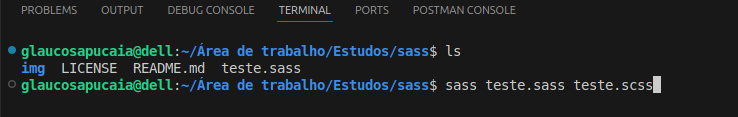
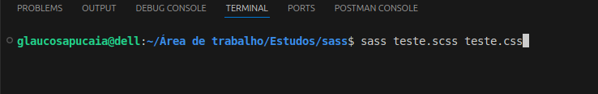
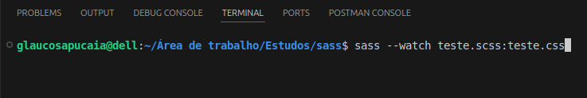
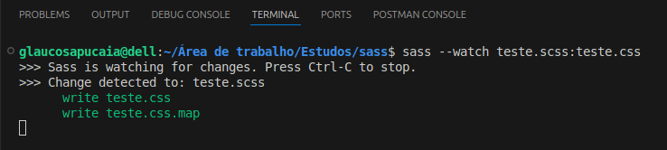

# sass-CSS
Estudos com scss

## Tools
- [sass](https://sass-lang.com/)

## Install sass

## Convertendo extensões | sass -> scss  
  
Da forma abaixo, é criado também o arquivo .map, que organiza e mapeia o código .sass  

## Convertendo extensões | scss -> css  

## Monitorando arquivos | Coerção automática
  
  
Arquivo sendo atualizado  
